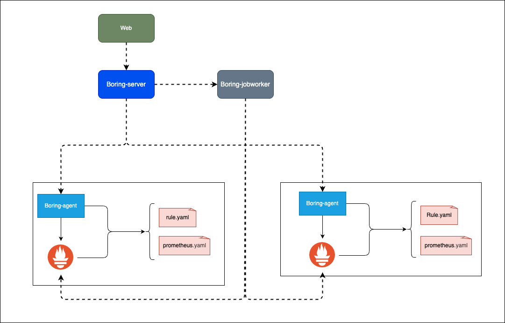
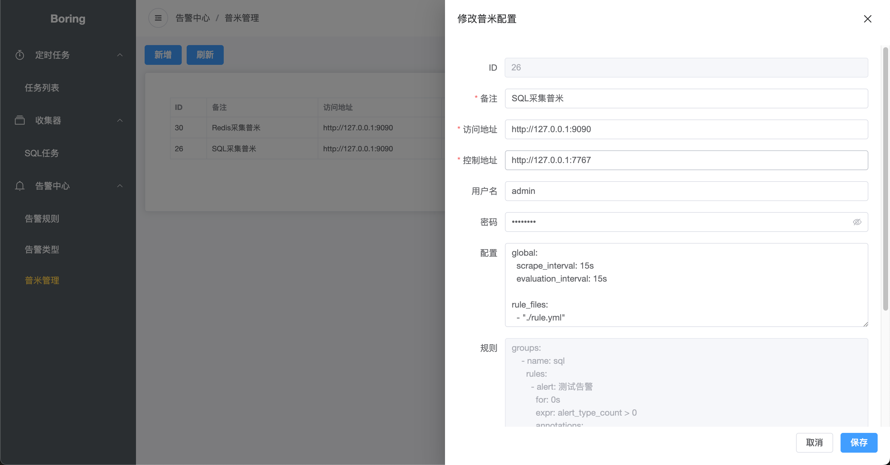
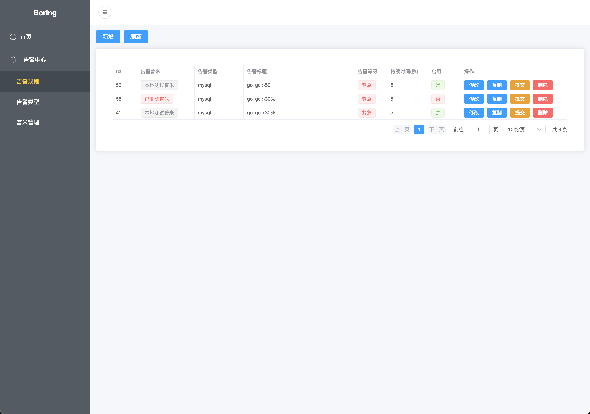
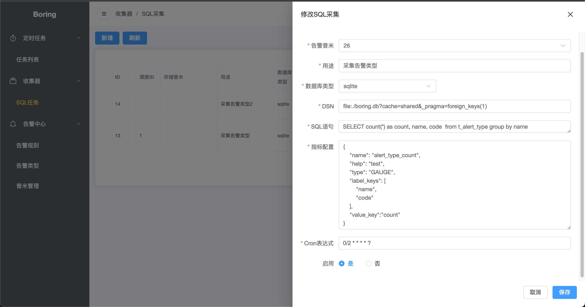

# Boring
**Boring** is a lightweight alerting system built on Prometheus. It centralizes management of Prometheus services distributed across different locations and supports scheduled SQL data collection.

# Features
- Manage multiple Prometheus service configurations
- Graphical alert rule configuration
- Periodic SQL data collection

# Architecture


- **boring-server**: Core management service that implements scheduled jobs, alert rule configuration, data collection configuration, and related functions.
- **boring-agent**: Deployed on Prometheus hosts; receives configurations from **boring-server** and writes them to files.
- **boring-jobworker**: Receives scheduled collection tasks from the scheduler and pushes collected data to the specified Prometheus instance.

# Deployment & Run

### Build backend
```
cd ./server && ./build.sh
```

### Example `conf.yaml`:
```yaml
server:
  port: 7832
  host: 0.0.0.0

db:
 type: sqlite
 dsn: file:./boring.db?cache=shared&_pragma=foreign_keys(1)

job_worker_address: http://0.0.0.0:7855

job_worker:
  port: 7855
  host: 0.0.0.0
```

### 1. Start `boring-agent`
```
# Run on the host where Prometheus is deployed
./boring-agent --port 7767 --web.config.file ~/path/web-config.yml --config.file ~/path/prometheus.yml --rule.file ~/path/rule.yml
```

### 2. Start `boring-jobworker`
```
# You can deploy multiple instances behind an nginx reverse proxy
./boring-jobworker --config ./conf.yaml
```

### 3. Start `boring-server`
```
./boring-server --config ./conf.yaml
```

### 4. Run frontend
```
cd ./web
npm install
npm run dev
```

# Usage

### Manage Prometheus instances
- In the management UI, add or edit a Prometheus instance and provide the access address, control address (the address `boring-agent` listens on), username/password, and other details.
- Rules are created via the alert rule configuration page and will be synchronized to the corresponding Prometheus instances after submission.



### Manage alert rules
Alert rules use standard PromQL syntax.


### Create SQL collection task
Example metric configuration:
```
{
    "name": "alert_type_count", # Metric name stored in Prometheus
    "help": "test",
    "type": "GAUGE",
    "label_keys": [             # Map SQL result fields to metric labels
        "name",
        "code"
    ],
    "value_key":"count"         # Map SQL numeric field to metric value
}
```




# CHANGELOG
[CHANGELOG.md](./CHANGELOG.md)
