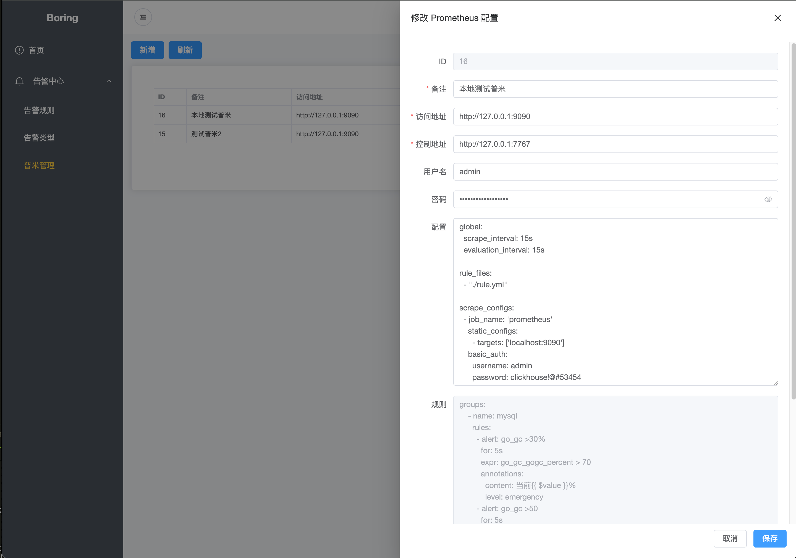
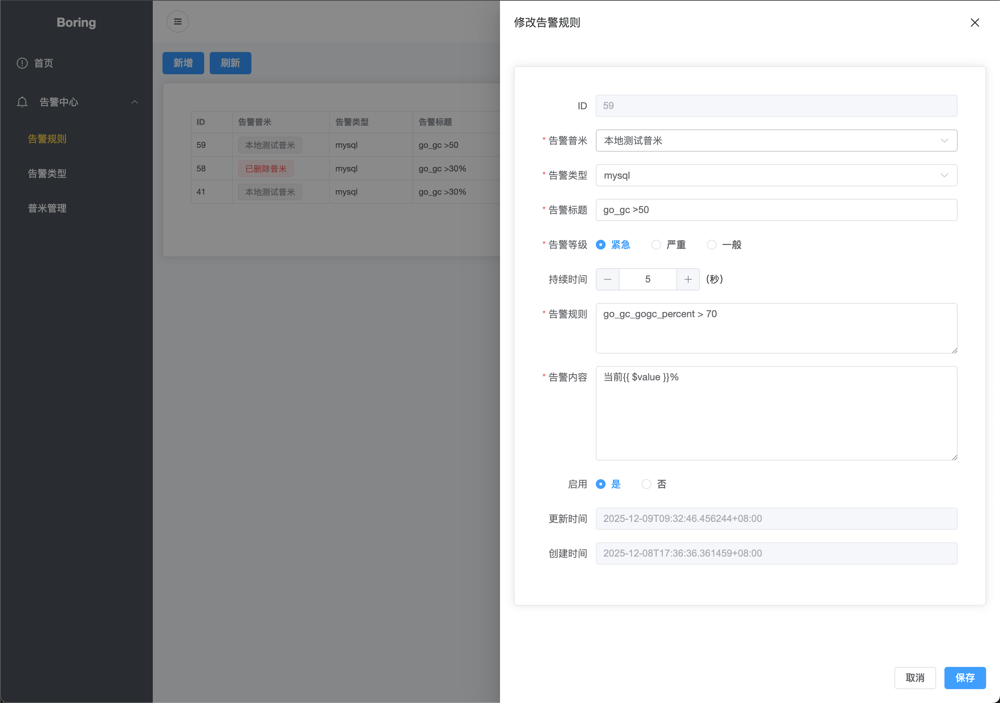

# Boring
轻量、简洁、灵活部署的Prometheus管理系统，提供统一的Web页面进行告警规则配置

## 1. 架构图


### *boring*
1. 管理的核心程序，负责Prometheus的配置，并下发指令到boring-agent
### *boring-agent*
1. 用于重写其配置文件和规则文件
2. 执行prometheus重载


## 2. 本地运行

### 运行 *boring-agent*
*boring-agent* 部署在prometheus的机子上
```
./boring-agent --port 7767--web.config.file ~/{path}/web-config.yml --config.file ~/{path}/prometheus.yml --rule.file ~/{path}/rule.yml
```

### 运行 *boring*

1. 创建一个 sqlite 数据库文件，并使用 ./server/init.sql 初始化表

2. 创建 *boring* 运行的配置文件, conf.yaml如下所示
``` yaml
db:
 type: sqlite
 dsn: file:boring.db?cache=shared&_pragma=foreign_keys(1)
 path: ./boring.db  #sqlite数据库文件路径

server:
  port: 7832  # 监听端口
  host: 0.0.0.0
```
```
cd ./server
go run ./cmd/server --config ./conf.yaml
```

### 运行前端
```
cd ./web
npm install
npm run dev
```

### 编译后端
```
cd ./server && sh build.sh
```

### 编译前端
```
cd ./web && npm run build
```

## 3. 使用手册

### 配置普米
点击新增或修改按钮, 添加prometheus的访问地址、控制地址(boring-agent访问地址)、用户名、密码等
>*ps*: 规则由规则配置页面设置后，自动生成


### 配置规则
点击新增或修改按钮，完成告警规则设置后，点击提交按钮使规则在对应的普米生效



### [CHANGELOG.md](./CHANGELOG.md)
